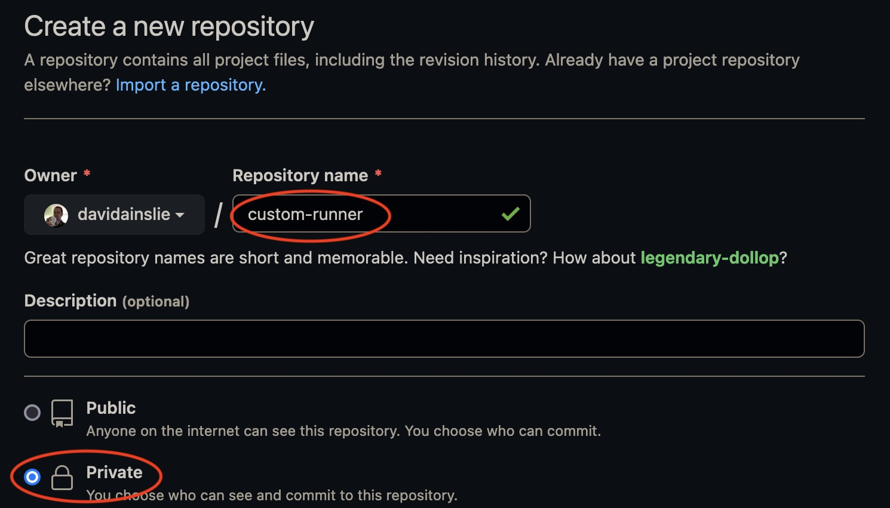
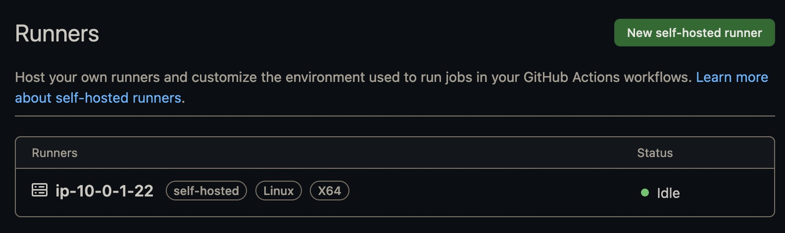
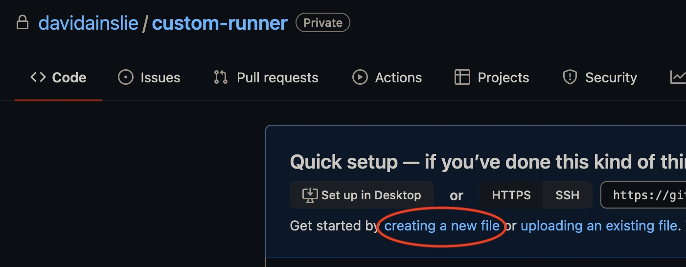
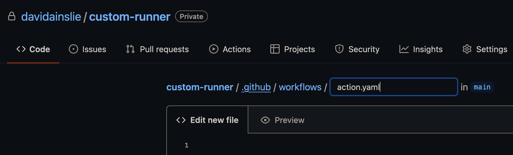
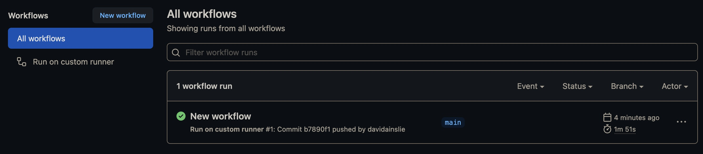

# Setting up a Custom GHA Runner

## Task

You are setting up a new app’s CI/CD process.
Due to compliance requirements, this team’s code needs to run on your organization’s infrastructure, not GitHub’s.
You will be provided with an EC2 instance, which you will need to set up to work as a GitHub runner.
You will then need to set up a workflow to run only on that runner.
Finally, you will need to disconnect the runner from your repo for the end of the lab.

```
GitHub.com ------------------------------> Custom Runner (e.g. on AWS)
                                                    ^
                                                    |
Code Repository -------------------------------------
```

## Solution

- Create a new GitHub repository e.g. `custom-runner`.

- Settings > Actions > Runners > New self hosted runner
  - Run each command given in the instructions on the relevant machine e.g.
    - The machine maybe an EC2 instance having chosen Linux.
    - The machine maybe your local machine having chosen Mac.

When we run the `configuration` command, we'll be presented with some questions (which we'll just accept the default answers):
```
./config.sh --url https://github.com/davidainslie/custom-runner --token xxxxx

--------------------------------------------------------------------------------
|        ____ _ _   _   _       _          _        _   _                      |
|       / ___(_) |_| | | |_   _| |__      / \   ___| |_(_) ___  _ __  ___      |
|      | |  _| | __| |_| | | | | '_ \    / _ \ / __| __| |/ _ \| '_ \/ __|     |
|      | |_| | | |_|  _  | |_| | |_) |  / ___ \ (__| |_| | (_) | | | \__ \     |
|       \____|_|\__|_| |_|\__,_|_.__/  /_/   \_\___|\__|_|\___/|_| |_|___/     |
|                                                                              |
|                       Self-hosted runner registration                        |
|                                                                              |
--------------------------------------------------------------------------------

# Authentication

√ Connected to GitHub

# Runner Registration

Enter the name of the runner group to add this runner to: [press Enter for Default]

Enter the name of runner: [press Enter for ip-10-0-1-22]

This runner will have the following labels: 'self-hosted', 'Linux', 'X64'
Enter any additional labels (ex. label-1,label-2): [press Enter to skip]

√ Runner successfully added
√ Runner connection is good

# Runner settings

Enter name of work folder: [press Enter for _work]

√ Settings Saved.

[cloud_user@ip-10-0-1-22 actions-runner]$ ./run.sh

√ Connected to GitHub

Current runner version: '2.290.1'
2022-04-16 13:26:27Z: Listening for Jobs
```

Back in our GitHub repository, we'll see our new custom runner:


To see our workflow running, we'll need a file:




and we'll provide the details:
```yaml
name: Run on custom runner

on: push

jobs:
  init:
    runs-on: self-hosted
    
    steps:
      - run: echo "Well hello there"
      - run: echo $HOSTNAME
```

Commit said file and go to `Actions` (tab):


And on the machine running our workflow e.g. an EC2 instance, we'll see some logging:
```shell
Current runner version: '2.290.1'
2022-04-16 13:41:55Z: Listening for Jobs
2022-04-16 13:41:56Z: Running job: init
2022-04-16 13:42:00Z: Job init completed with result: Succeeded
```

## Clean up

Let's disconnect the runner from the GitHub repository:

Settings > Actions > Runners > Click on relevant runner > Remove

(And you can also delete the GitHub repository).